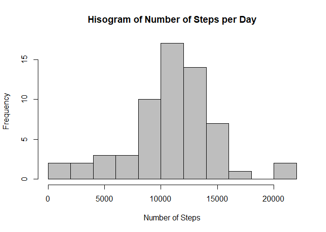

# Reproducible Research: Peer Assessment 1
Daniel Vena  
October 9th, 2017  


## Loading and preprocessing the data
The section of code below first sets a working directory and then loads the activity data and store it in a variable called activity_data


```r
wd <- "C:/Users/venadani/Dropbox/Courses/Data Science Specialization/Reproducible/CourseProject1/RepData_PeerAssessment1"
setwd(wd)
activity_data <- read.csv(unz("activity.zip", "activity.csv"))
activity_data <- mutate(activity_data, 
                        date = as.Date(date), 
                        days = date - date[1], 
                        wkdays = weekdays(date))
```

## What is mean total number of steps taken per day?
The section of code below will sum the total number of steps that occurred on each unique date. This is done by summing steps across date as a factor.


```r
numSteps <- with(activity_data, tapply(steps, date, sum, na.rm=TRUE))
hist(numSteps, breaks = 12, main = "Histogram of Number of Steps per Day", 
     xlab = "Number of Steps", col = "grey")
```

<!-- -->

### Mean and Median Number of Steps per Day

```r
meanNumSteps <- mean(numSteps)
medNumSteps <- median(numSteps)
data.frame("Number of Steps" = c(meanNumSteps, medNumSteps), row.names = c("Mean", "Median"))
```

```
##        Number.of.Steps
## Mean           9354.23
## Median        10395.00
```
* Mean number of steps: 9354.23
* Median number of steps: 10395

## What is the average daily activity pattern?
### Time series plot of of 5-minute interval and average number of steps taken, averaged across all days

```r
dailySteps <- with(activity_data, tapply(steps, interval, mean, na.rm=TRUE))

plot(names(dailySteps), dailySteps, type ="l", lwd = 2, main = "Meant Daily Steps per Interval",
     xlab = "Daily Interval", ylab = "Number of Steps")
```

<!-- -->

### The 5-minute interval averaged across all the days in the dataset that contains the max number of steps

```r
findMax <- reshape(activity_data, v.names = "steps", timevar = "interval", idvar = "date", direction = "wide")
rownames(findMax) <- findMax[,1]
findMax[,1:3] <- NULL
colnames(findMax) <- levels(as.factor(activity_data$interval))
maxDailySteps <- apply(findMax, 2, mean, na.rm=TRUE)
maxInterval <- levels(as.factor(activity_data$interval))[which.max(maxDailySteps)]
```

* Max 5-minute interval: 835

## Inputing missing values

```r
# find the total number of missing values
numNA <- sum(is.na(activity_data$steps))

# Create a new data set with NA data filled in
wkday_lvls <- levels(as.factor(activity_data$wkdays))
activity_data_narm <- activity_data

# loop through each day of the week, find the indices of NA in that day of the week, then replace those indices with the mean number of steps taken on that day of the week. 
for (ii in 1:length(wkday_lvls)) {
      wkdayIdx <- activity_data$wkdays == wkday_lvls[ii]
      idx <- (wkdayIdx & is.na(activity_data$steps)) 
      activity_data_narm$steps[idx] <- mean(activity_data$steps[wkdayIdx], na.rm = TRUE)
}

# find total number of steps taken per day with NA removed
numSteps_narm <- with(activity_data_narm, tapply(steps, date, sum))

# generate histogram of total number of steps per day with NA removed
hist(numSteps_narm, breaks = 12, main = "Hisogram of Number of Steps per Day", 
     xlab = "Number of Steps", col = "grey")
```

<!-- -->

```r
# find mean and median number of steps with NA removed
meanNumSteps_narm <- mean(numSteps_narm)
medNumSteps_narm <- median(numSteps_narm)
```
### Mean and Median Number of Steps with and without NA removed
* Mean number of steps with NA removed is 10821.21, and 9354.23 without NA removed
* Median number of steps with NA removed is 11015, and 10395 without NA removed

## Are there differences in activity patterns between weekdays and weekends?


```r
wkdayIdx <- activity_data_narm$wkdays == "Monday" | 
            activity_data_narm$wkdays == "Tuesday" | 
            activity_data_narm$wkdays == "Wednesday" | 
            activity_data_narm$wkdays == "Thursday" | 
            activity_data_narm$wkdays == "Friday"

wkendIdx <- activity_data_narm$wkdays == "Saturday" | 
            activity_data_narm$wkdays == "Sunday"

activity_data_narm <- mutate(activity_data_narm, weekend = wkendIdx,
                                                  weekday = wkdayIdx)

# find daily steps 
dailySteps_we <- with(activity_data_narm[activity_data_narm$weekend, ], 
                      tapply(steps, interval, mean, na.rm=TRUE))

dailySteps_wd <- with(activity_data_narm[activity_data_narm$weekday, ], 
                      tapply(steps, interval, mean, na.rm=TRUE))

par(mfrow=c(2,1))
par(mar = c(0.5,0,1.5,0))
par(oma = c(4,4,0.5,0.5))
plot(dailySteps_wd, type = "l", lwd = 2, main = "Weekday", xaxt='n', ylab = "Number of Steps") 
plot(names(dailySteps_we), dailySteps_we, type = "l", lwd = 2, main = "Weekend", xlab = "Interval (min)", ylab = "Number of Steps")
```

<!-- -->
